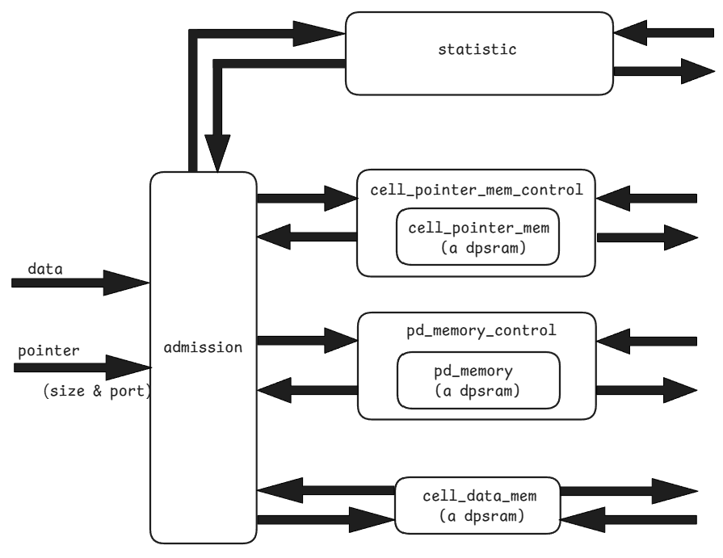
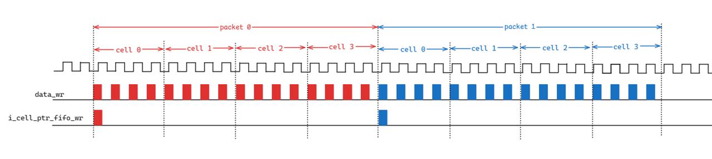

# Enqueue of Occamy

The data packet enqueue operation has been completed.

### Below is the basic structure of the enqueue circuit diagram:

### The following diagram shows the logic of enqueuing data packets and their corresponding pointers:

### TODO:

* The 4+1 FIFO method is still used to control the pd memory.
* RAM has only two ports, so the time needs to be coordinated when dequeuing